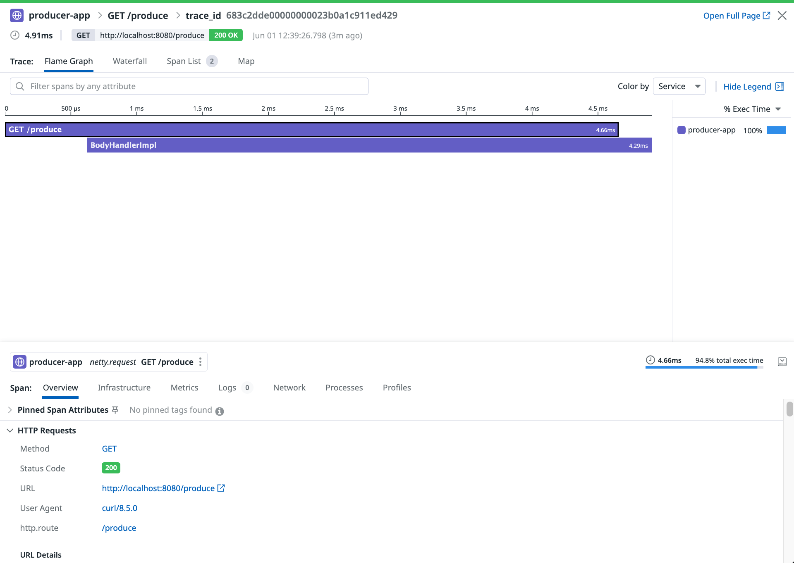

# Vert.x distributed tracing with Datadog

This project demonstrates distributed tracing across microservices using **Vert.x**, **Spring Boot**, **Hazelcast clustering**, and **Datadog**

## Architecture overview

```
[HTTP Request] → [Producer application] →     [Event bus]     →    [Consumer application]
                       ↓                                                      ↓
                [Datadog Agent] ← ← ← ← ← ← ← ← ← ← ← ← ← ← ← ← ← ← [Datadog Agent]
                       ↓                                                      ↓
                            [Datadog backend - Unified trace view]
```

### Event bus message flow

```
HTTP GET /produce
    ↓
HttpServerVerticle
    ↓ (sends to "producer.trigger")
ProducerVerticle.triggerMessage()
    ↓ (sends to "consumer.message")
ConsumerVerticle.processMessage()
    ↓ (replies)
ProducerVerticle (receives reply)
    ↓ (replies to HttpServerVerticle)
HttpServerVerticle (responds to HTTP)
```

### Event bus communication levels

1. **Local Event Bus** (`producer.trigger`)
    - Communication within producer application
    - HttpServerVerticle → ProducerVerticle
    - Same JVM

2. **Clustered Event Bus** (`consumer.message`)
    - Communication between producer and consumer applications
    - Cross-network, different JVMs
    - Full automatic injection

### Goal of each components

- **HttpServerVerticle**: Handles HTTP protocol concerns
- **ProducerVerticle**: Handles business logic and cross-service communication
- **ConsumerVerticle**: Handles message processing
- **Event Bus**: Provides loose coupling between components

### Available endpoints

- `GET /hello` → Simple health check returning "Hello from Vert.x (Clustered)"
- `GET /greet/{name}` → Greeting service functionality
- `GET /produce` → **Main flow trigger** - initiates the distributed trace flow


### Benefits of this approach

1. Proper Vert.x pattern: Uses event bus for inter-verticle communication
1. Clustering support: Works across multiple Vert.x instances in a cluster
1. Loose coupling: Verticles don't need direct references to each other
1. Error handling: Can handle cases where the producer isn't available
1. Asynchronous: Non-blocking communication

Now when you hit http://localhost:8080/produce, it will properly trigger your ProducerVerticle through the event bus!


## Prerequisites

### Required software
- Java 17+
- Docker & Docker compose
- Git client
- Datadog account with a valid API key.
- wget (for downloading DataDog Java agent)
- Your favorite text editor or IDE (Ex IntelliJ, VScode...)


### Clone the repository

```bash
[root@pt-instance-2:~/]$ git clone https://github.com/ptabasso2/vertx-multi-spring-boot-clustered 
[root@pt-instance-2:~/]$ cd vertx-multi-spring-boot-clustered
````


## Project structure

```
vertx-multi-spring-boot-clustered/
├── dd-java-agent.jar                    # ← Datadog java agent (auto-downloaded)
├── docker-compose.yml                   # ← Container orchestration
├── producer-app/                        # ← HTTP API + Message producer
│   ├── src/main/java/com/datadoghq/pej/producer/
│   │   ├── ProducerApplication.java     # ← Bootstrap the producer
│   │   ├── ProducerVerticle.java        # ← Producer processing
│   │   ├── GreetingVerticle.java
│   │   └── HttpServerVerticle.java
│   ├── build.gradle.kts                 # ← Build file
│   └── Dockerfile                       # ← Datadog agent integration
└── consumer-app/                        # ← Message consumer
    ├── src/main/java/com/datadoghq/pej/consumer/
    │   ├── ConsumerApplication.java     # ← Bootstrap the consumer
    │   └── ConsumerVerticle.java        # ← Consumer processing
    ├── build.gradle.kts                 # ← Build file
    └── Dockerfile                       # ← Datadog agent integration
```

## Key implementation highlights


### Datadog java agent set up
Applications run with the Datadog java agent for full automatic instrumentation:

```docker-compose.yml
...
    environment:
      # Spring Boot profiles
      - SPRING_PROFILES_ACTIVE=docker
      # JVM settings for containerized environment
      - JAVA_OPTS=-XX:+UseContainerSupport -XX:MaxRAMPercentage=75.0
      # Hazelcast network configuration
      - HAZELCAST_NETWORK_JOIN_MULTICAST_ENABLED=false
      - HAZELCAST_NETWORK_JOIN_TCP_IP_ENABLED=true
      - HAZELCAST_NETWORK_JOIN_TCP_IP_MEMBERS=consumer-app,producer-app
      - JAVA_TOOL_OPTIONS=-javaagent:/app/dd-java-agent.jar -Ddd.agent.host=dd-agent-dogfood-jmx -Ddd.service=consumer-app -Ddd.env=dev -Ddd.version=12 -Ddd.trace.sample.rate=1 -Ddd.logs.injection=true -Ddd.profiling.enabled=true -XX:FlightRecorderOptions=stackdepth=256 -Ddd.tags=env:dev
...
```

The `JAVA_TOOL_OPTIONS` env variable contains the necessary options to configure the Datadog java agent.

## 🚀 How to build

### 1. Set up the environment (Automated)


```bash
# Make sure to export your API key before running the script. Run the setup script (handles agent download + build)

[root@pt-instance-2:~/vertx/vertx-multi-spring-boot-clustered]$ export DD_API_KEY=<your API key>
[root@pt-instance-2:~/vertx/vertx-multi-spring-boot-clustered]$ chmod +x docker-setup.sh
[root@pt-instance-2:~/vertx/vertx-multi-spring-boot-clustered]$ ./docker-setup.sh
````

### 2. Manual build process
```bash
# Download the Datadog java agent
wget -O dd-java-agent.jar 'https://dtdg.co/latest-java-tracer'

# Build consumer application
cd consumer-app
./gradlew clean build
cd ..

# Build producer application  
cd producer-app
./gradlew clean build
cd ..

# Build and start Docker containers
docker-compose build
docker-compose up -d
```

## 🧪 How to test

### 1. Verify services are running
```bash
# Check container status
docker-compose ps

# Expected output:
[root@pt-instance-2:~/vertx/vertx-multi-spring-boot-clustered]$ docker-compose ps
        Name                      Command                   State                                                  Ports                                          
------------------------------------------------------------------------------------------------------------------------------------------------------------------
dd-agent-dogfood-jmx   /bin/entrypoint.sh               Up (healthy)     0.0.0.0:8125->8125/tcp,:::8125->8125/tcp, 8125/udp,                                      
                                                                         0.0.0.0:8126->8126/tcp,:::8126->8126/tcp                                                 
vertx-consumer         sh -c java $JAVA_OPTS -jar ...   Up (healthy)   8081/tcp                                                                                 
vertx-producer         sh -c java $JAVA_OPTS -jar ...   Up (healthy)     0.0.0.0:8080->8080/tcp,:::8080->8080/tcp         
```

### 2. Test basic functionality
```bash
# Health check
curl http://localhost:8080/hello
# Expected: "Hello from Vert.x (Clustered)"

# Greeting service
curl http://localhost:8080/greet/Alice
# Expected: "Hi Alice, this is a Vert.x-powered greeting!"
```

### 3. Test distributed tracing
```bash
# Trigger producer-consumer communication with tracing
curl http://localhost:8080/produce
# Expected: "Triggered producer verticle: Message triggered successfully"
```

### 4. Verify processing details in the containers logs

**Producer logs should show:**
```
...
Triggering message from producer...
Producer received reply from consumer: Message processed successfully by consumer at 1748774535857
...
```

**Consumer logs should show:**

```
...
Consumer received: Hello from Producer!
...
```

### 5. View traces in Datadog

1. **Open the Datadog UI**: Navigate to APM → Traces in the UI
2. **Search for services**: Look for `producer-app` and `consumer-app`
3. **View Distributed trace**: Click on a trace to see the partial request flow

> [!IMPORTANT]
> Hazelclast clustering relies on TCP connection which is an unsupported protocol. Therefore in this case context propagation will not take place. This means that in this case **only the producer app will be traced** 

<p align="left">
  
</p>

**Expected trace structure:**
```
natty.request (Root Span - HTTP Request: GET /produce)
├── vertx.route_handler (Producer handling)
├── producer.send_message (Event bus send)

```

**Expected trace attributes:**
- **Service names**: `producer-app`
- **Operation names**: `http.produce`, `producer.send_message`
- **Custom attributes**: `message.type`, `message.destination`, `reply.success`

## 🔧 Debugging

### Check Datadog agent connectivity
```bash
# Verify agent is receiving traces
curl http://localhost:8126/info
# Should return Datadog agent info

# Check agent logs
docker logs datadog-agent | grep -i trace
```

### View application logs
```bash
# Producer logs
docker-compose logs -f producer-app

# Consumer logs  
docker-compose logs -f consumer-app

# All logs
docker-compose logs -f
```

### Common issues

1. **No traces in Datadog**: Check agent connectivity and API key
2. **Broken traces**: Verify trace context injection/extraction
3. **Wrong service names**: Ex verify `DD_SERVICE` environment variables

## Expected Datadog metrics

Once running successfully, you should see:

- **Services**: `producer-app`, `consumer-app` in the Datadog APM UI
- **Throughput**: Request rate metrics for `/produce` endpoint
- **Latency**: P50, P95, P99 latency distributions
- **Error rate**: Success/failure rates for distributed operations
- **Service map**: Visual representation of producer & consumer

## Success criteria

✅ **Containers running**: Both services start without errors  
✅ **HTTP endpoints**: All endpoints respond correctly  
✅ **Event Bus communication**: Producer and consumer exchange messages  
✅ **Datadog integration**: Traces visible in Datadog APM UI (Trace explorer)  

When all success criteria are met, a functional distributed tracing setup showing request flows across this microservices architecture will be in place.